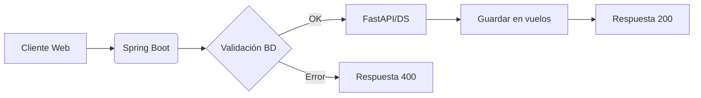

# 🎤 Presentación: Flight on Time – Equipo 62

## 🛫 1. Introducción: El problema y solución
> Todos los que viajan en avión —y especialmente las aerolíneas y aeropuertos— sufren con retrasos. Estos retrasos causan insatisfacción en los pasajeros, costos extras para las empresas y problemas de logística (como conexiones perdidas y reajustes de vuelos).
> El cliente quiere predecir, basándose en datos del vuelo (origen, destino, hora, aerolínea, etc.), cuál es la probabilidad de que el vuelo se retrase para prepararse con antelación
> 
> Una alternativa viable es que nuestro proyecto **Flight On Time** pronostique si un vuelo de pasajeros saldrá **puntual o retrasado** y entrega la **probabilidad exacta** de ese resultado. Esta es nuestra solución al desafío propuesto.

## 🧠 2. Tecnología y modelo de Machine Learning
> Para lograrlo, entrenamos un modelo de **Machine Learning supervisado**, usando datos históricos de vuelos reales.  
> El modelo fue optimizado, serializado en formato **Joblib**, y expuesto como un microservicio mediante **FastAPI y Uvicorn** en Python.
> ✈️ [![Video: FlightOnTime - Machine Learning]](https://youtu.be/hjA9zRGsb4A?si=cpP2I418jpzv9w2Q&t=27)

## ⚙️ 3. Arquitectura del sistema
> La arquitectura es modular y robusta.  
> El backend principal está construido en **Java con Spring Boot**, y actúa como orquestador del flujo completo.

## 🔐 4. Validación inteligente con base de datos
> Primero, valida todos los datos de entrada: aerolínea, origen, destino, fecha, hora y distancia.  
> Y aquí tomamos una decisión clave:  
> **en lugar de usar archivos CSV, validamos todo desde una base de datos MySQL**.  
> Esto nos da **integridad de datos**, soporte para múltiples usuarios simultáneos y respuestas más rápidas.
> ✈️ [![Video: FlightOnTime - Validación]](https://youtu.be/hjA9zRGsb4A?si=OJ53i-gc0EOdYc38&t=57)

## 🌍 5. Manejo de zonas horarias
> Una vez validado, el sistema convierte la hora local a la **zona horaria del aeropuerto de origen**, usando **ZonedDateTime de Java**.  
> Luego, realiza una llamada HTTP al microservicio de Python, que ejecuta el modelo y devuelve la predicción.
> ✈️ [![Video: FlightOnTime - Validación]](https://youtu.be/hjA9zRGsb4A?si=JP2jHuUGjsZ2uhyf&t=85)

## 🛠️ 6. Tecnologías utilizadas
> - **FastAPI en Python 3.12**: para el modelo de Machine Learning  
> - **Java 17.0 y Spring Boot 3.3.6**: para el backend principal  
> - **MySQL 8.0 y Workbench 8.0**: para administrar las tablas de aerolíneas, aeropuertos, zonas horarias y rutas válidas  
> - **HTML5, CSS3 y JavaScript ES2024**: para la interfaz web  
> - Toda la infraestructura fue desplegada en una máquina virtual de **Oracle Cloud**

## 🌐 7. Demostración en vivo
> Ahora, les mostramos el sistema en acción, a través de su dirección pública:  
> **161.153.195.108**
> ✈️ [![Video: FlightOnTime - Validación]](https://youtu.be/hjA9zRGsb4A?si=n7SAdNNj9y1Dtc4I&t=132)



> Gracias a que todo se basa en base de datos, los campos de aerolínea, origen y destino son **menús desplegables**.  
> Esto evita errores de escritura, mejora la experiencia del usuario… y elimina validaciones innecesarias.

> Detrás de escena, todas estas validaciones se ejecutan en tiempo real, consultando cuatro tablas:  
> - **aerolineas**  
> - **aeropuertos**  
> - **aeropuertos_zonas**  
> - **rutas_validas**
> La tabla **vuelos**, inicialmente vacía, solo acepta datos validados.
> En la página principal, seleccionamos:  
> - Aerolínea  
> - Aeropuerto de origen  
> - Aeropuerto de destino  
> - Fecha y hora de salida  

> Y observen: **la distancia se rellena automáticamente**.  
> El sistema consulta la tabla `rutas_validas` y obtiene la distancia real entre esos dos puntos.

> Si omitimos algún campo, el sistema responde al instante:  
> **“Todos los campos son obligatorios”**.

> Al presionar **“Predecir”**, el sistema valida, consulta el modelo de Machine Learning…  
> y devuelve, por ejemplo:  
> **“Retrasado, con una confianza del 71 por ciento”**.

> Si revisamos la tabla `vuelos`, confirmamos que el registro se guardó correctamente.

> Si ingresamos una fecha anterior a la actual,  
> el sistema no compara contra la hora local del usuario…  
> sino contra la **zona horaria del aeropuerto de origen**.  
> Y responde:  
> **“La fecha de partida debe ser futura en [código]”**.

> Y si la ruta no existe en nuestra base de datos,  
> muestra claramente:  
> **“Ruta no soportada”**.

> En una prueba adicional, ingresamos una hora que parece pasada según la hora local de Chile.  
> Pero el sistema reconoce que el aeropuerto de origen es **Denver**…  
> convierte la hora a su zona horaria…  
> y valida contra UTC.  
> Esto garantiza **coherencia global**, sin importar desde dónde se acceda.

## 📥 8. Procesamiento por lotes
> Finalmente, implementamos una funcionalidad avanzada: **procesamiento por lotes**.  
> Subimos un archivo CSV con múltiples vuelos…  
> y el sistema devuelve un informe detallado:  
> - Qué registros fueron exitosos  
> - Cuáles fallaron  
> - Y el motivo exacto de cada error
> - Para realizar una prueba, puede utilizar el archivo: ~/docs/lote.csv
> ✈️ [![Video: FlightOnTime - Validación]](https://youtu.be/hjA9zRGsb4A?si=jQOvoVeIfdt5O0pU&t=326)

## 🧪 **9. Pruebas automatizadas**
> Como parte de nuestra calidad, realizamos:  
> - **Pruebas unitarias con Mockito**: no dependen de archivos ni base de datos, usan mocks y cubren todos los casos de validación.  
> - **Pruebas de integración con H2**: comprueban que los repositorios funcionan correctamente con JPA.
> ✈️ [![Video: FlightOnTime - Validación]](https://youtu.be/hjA9zRGsb4A?si=pscvWfAqAtcg0MoP&t=364)

## 🛠️ 10. Instalación del entorno virtual (Linux)

1. **Directorio raíz:**
```plaintext
.
├── backend
├── data_science
```

2. **Ir al directorio data_science**

    ```bash
    cd ~/data_science
    ```
   
3. **Crear el entorno virtual:**

```bash
sudo apt install python3.12-venv # Instalar python3
python3 -m venv .venv  # Crear nuevo entorno virtual
```
    
3. **Actívarlo:**

```bash
source .venv/bin/activate
```

	Para desactivarlo escribir:

```bash
deactivate
```

4. **Instalar las librerías necesarias:**
   
```bash
pip install fastapi uvicorn scikit-learn pandas joblib numpy
```

5. **Prueba rápida de encendido:**

```bash
uvicorn main:app --host 0.0.0.0 --port 8000
```

- Si ve "Application startup complete", (Sistema virtual funcionando)
    
- Presiona **`Ctrl + C`** para apagarlo y volver a la terminal.

## 🖥️ **11. Configuración y ejecución del backend en IntelliJ IDEA (Spring Boot)**

El backend del proyecto **FlightOnTime** está desarrollado en **Java con Spring Boot** y se comunica con una base de datos **MySQL**. A continuación, se describe cómo configurarlo y ejecutarlo localmente en su PC.

### 1. Clonar o copiar el proyecto en tu PC
- Asegúre de tener el directorio `backend` en una carpeta local, por ejemplo:
  ```
  ~/proyectos/FlightOnTime/backend
  ```

### **2. Abrir el proyecto en IntelliJ IDEA**
1. Abra **IntelliJ IDEA**.
2. Seleccione **“Open”** o **“Open Project”**.
3. Navegar hasta la carpeta `backend` (la que contiene el archivo `pom.xml`).
4. Haga clic en **OK**. IntelliJ reconocerá automáticamente el proyecto como un proyecto Maven.

> Si es la primera vez que lo abres, IntelliJ descargará las dependencias automáticamente.

### **3. Configurar y activar MySQL localmente**
El backend requiere una base de datos MySQL en ejecución.

1. Asegure de tener **MySQL Server** instalado y en ejecución:
   ```bash
   sudo systemctl start mysql
   sudo systemctl status mysql  # Verifica que esté activo
   ```
2. Crear la base de datos y los usuarios necesarios (si aún no existen):
   ```sql
   CREATE DATABASE flighton;
   CREATE USER 'flights_user'@'localhost' IDENTIFIED BY 'tu_contraseña_segura';
   GRANT ALL PRIVILEGES ON flightontime.* TO 'flights_user'@'localhost';
   FLUSH PRIVILEGES;
   ```

3. Verifique que los datos de conexión a la Base de Datos coincidan con el archivo:

> **Importante:** flights_user y tu_contraseña_segura en en el Punto 2 y 3 deben ser la misma

```
backend/src/main/resources/application.properties
```

   Ejemplo esperado:
```properties
spring.datasource.url=jdbc:mysql://localhost:3306/flighton?useSSL=false&allowPublicKeyRetrieval=true&serverTimezone=UTC
spring.datasource.username=flights_user
spring.datasource.password=tu_contraseña_segura
spring.datasource.driver-class-name=com.mysql.cj.jdbc.Driver
```

> **Importante:** Los archivos .sql, para crear las tablas se encuentran en la carpeta:

```
backend/sql
```

### **4. Ejecutar la aplicación Spring Boot**

1. En IntelliJ, navegue a:
   ```
   src/main/java/com.hackathon/FlightApplication.java
   ```


2. Haga clic derecho sobre el archivo y seleccione **“Run ‘FlightApplication’”**.

3. Espere a que la consola muestre:
   ```
   Tomcat started on port(s): 8080 (http)
   Started FlightApplication in X.XXX seconds
   ```

### **5. Verificar que la API esté funcionando**

Abra su navegador y visite:

```
http://localhost:8080
```

## 🧪 12. Documentación API

> [API - Interfaz interactiva](http://161.153.195.108/swagger-ui.html)
> 
> [API - Especificaciones: ](http://161.153.195.108/v3/api-docs)
> 
> [API - Estructura General API: ](https://github.com/DnRiv/FlightOnTime-/blob/main/docs/FlightOnTime_API.pdf)

## 🛠️ 13. Mejoras futuras por incorporar a la aplicación

1. **Sistema de Suscripción:** Para que el usuario pueda recibir el estado del vuelo, de la consulta que realizó, momentos antes de viajar y tener un seguimiento real de su vuelo. 
2. **Integración de Clima:** Incorporar, a la predicción, datos reales del estado del clima en el momento del vuelo.
3. **Dashboard de Estadísticas:** Con una pestaña en el frontend que muestre gráficos, como por ejemplo, cuál es la aerolínea más puntual o impuntual, cuántos retrasos hubo en el día o datos históricos de aeropuertos y aerolíneas para contextualizar los retrasos.
4. **Verificación del Estado del Vuelo:** Con las aerolíneas, que pueden retrasar un vuelo por causas diferentes al clima, y poder alertar a los usuarios, como por ejemplo, si hay un retraso de cuánto tiempo será.
5. **Información en Tiempo Real de los Vuelos:** Para que el usuario pueda ver el estado del vuelo sin tener que ingresar datos a la aplicación, ya sea por no tener la tranquilidad suficiente o no tener el boleto al alcance de su mano, facilitándole información necesaria en tiempo real.